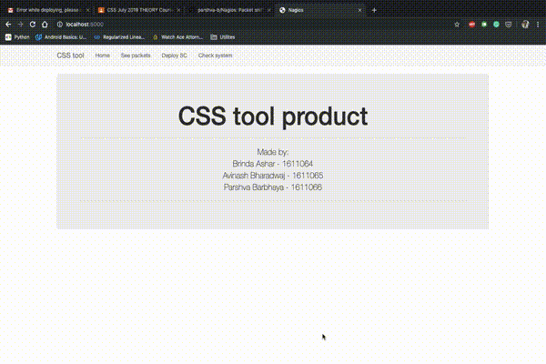

# Nagios
CSS - IA tool

## Tech Stack

Build on python version 3.7.3

UI is made using Flask on bootstrap

All dependencies are listed in the ‘/env’ folder
1. Flask (v1.1.1)
2. Pip3 (v19.2.3)
3. Pyshark
4. Psutil
5. Flask_Mail

## Important notice:

1. The /see route shows packets recieved at interface en0 (may need to be changed according to primary interface)
2. Change email, password to match your needs (app.py)

## Video:

